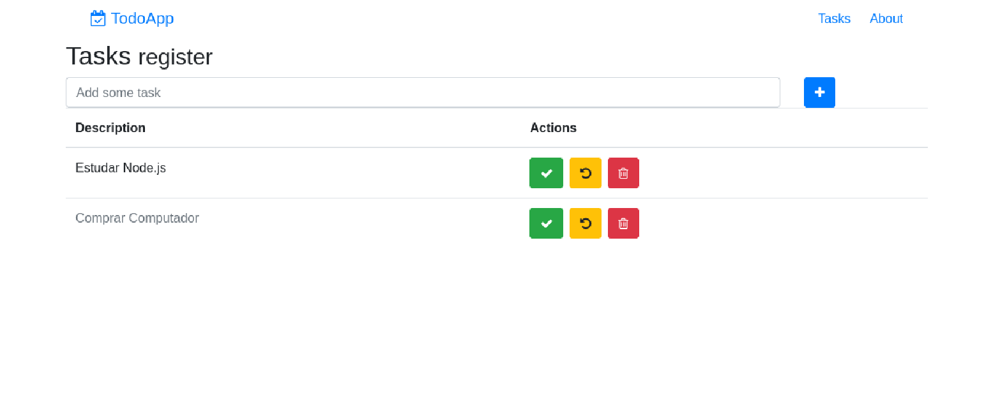

<h1 align="center"> TodoApp </h1>

<p align="center">
  
  
  
  
  
  
  
</p>

<p align="center">
  <a href="#-technologies">Technologies</a>&nbsp;&nbsp;&nbsp;|&nbsp;&nbsp;&nbsp;
  <a href="#-project">Project</a>&nbsp;&nbsp;&nbsp;|&nbsp;&nbsp;&nbsp;
  <a href="#-layout">Layout</a>&nbsp;&nbsp;&nbsp;|&nbsp;&nbsp;&nbsp;
  <a href="#memo-licença">Licença</a>
</p>

<p align="center">
  
</p>

<br>

<p align="center">
  
</p>

## 🚀 Technologies

This project was developed with the following technologies:

- HTML e CSS
- JavaScript
- React
- React Router
- Bootstrap
- Babel
- Webpack
- Node.js
- Express.js
- node-restful
- body-parser
- Mongoose
- Nodemon
- Axios
- PM2
- Git e Github

## 💻 Project

This is a personal project developed to practice my skills in React and Node.js, focusing on building a full-stack application with a RESTful API. The application allows users to create, read, and delete tasks, providing a simple yet effective way to manage daily activities. This repository hosts your personal task manager! This todo application provides a straightforward way to keep track of your work, helping you stay organized and accomplish your goals.

## 💻 How to run

```bash
# Clone the repository
git clone https://github.com/filipebteixeira98/todo-app.git

# Access the project folder
cd todo-app

# Access the backend folder
cd backend
# Install the dependencies
npm install
# or
npm i
# Run the backend
npm run dev
# The backend will be running on http://localhost:3003

# Access the frontend folder
cd ../frontend
# Install the dependencies
npm install
# or
npm i
# Run the frontend
npm run dev
# The frontend will be running on http://localhost:8080
```

## 📝 License

This project is under the MIT license.

<p align="center">
  Made with ♥ by me
</p>
